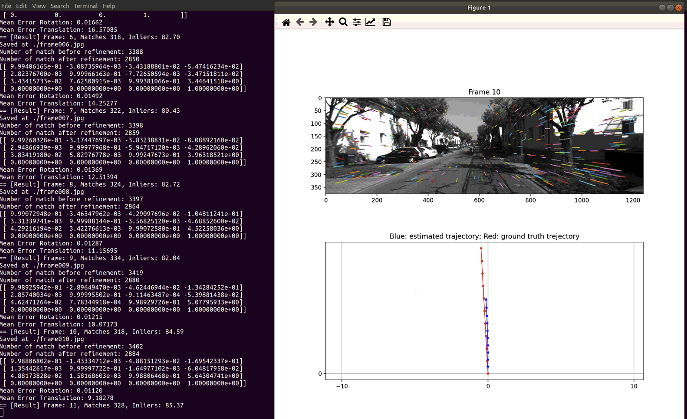

# CSE252D Spring 2022 HW1

### 1. Submission Instructions

1. Attempt all questions.
2. Please comment all your code adequately.
3. Include all relevant information such as text answers, output images in notebook.
4. **Academic integrity:** The homework must be completed individually.
5.  (**Imp**) Correctly select pages for each answer on Gradescope to allow smooth grading.
6. **Due date:** Assignments are due **Thu Apr 28, 11:59PM PST**.
7. Access this assignment by cloning this repository using,\
     ``git clone https://github.com/ViLab-UCSD/cse252d-sp22-hw1.git``\
    Note the changes in Github policy for cloning with personal access tokens [here](https://docs.github.com/en/authentication/keeping-your-account-and-data-secure/creating-a-personal-access-token).
8. The entry point to the assignment is the Jupyter Notebook ``hw1-CSE252D.ipynb``
9. Follow the rest of README (this file) for instructions on how to setup your environment, data and compute.
10. Submit the PDF version of your notebook and your code on **Gradescope**.\
    (1) Convert the ipynb file to **pdf** and upload it to **Homework 1 writeup**. Select pages for each answer.\
    (2) Compress your notebook, code and supporting results to **zip** and upload it to **Homework 1 code**. Do not include any dataset or large data files.
11.  Rename your submission files as `Lastname_Firstname.pdf` and `Lastname_Firstname.zip`.

### 2. Setup Jupyter
#### 2.1. [Option 1] On your own machine
- Install SWIG
    - On Ubuntu: `sudo apt-get install swig` (sudo required)
    - On MacOS: `brew install swig`\
         You need to install Homebrew first with [HomeBrew](https://brew.sh/)
- Install Python 3.X and Pip
- [Recommended] Create an environment (e.g. with [Anaconda](https://docs.conda.io/en/latest/miniconda.html))\
    ``conda create --name py36 python=3.6 pip``\
     ``conda activate py36``
- Install Jupyter Notebook\
    ``conda install jupyter``
- Install kernels for Jupter Notebook\
    ``conda install nb_conda``
- Launch Jupyter Notebook server\
    `jupyter notebook`\
    You will be provided with a URL that you can open locally.\
    In an opened notebook, change the kernel (Menu: **Kernel** -> **Change Kernel**) to the name of the conda env you just created (in this case `py36`).
    
#### 2.2. [Option 2] On Data Science & Machine Learning Platform
- (local) **(IMPORTANT) Connect to [UCSD VPN](https://blink.ucsd.edu/technology/network/connections/off-campus/VPN/index.html)**
- (local) Login with your Active Directory credentials\
    `ssh {USERNAME}@dsmlp-login.ucsd.edu`
- Launch your pod. 
    - You should enter a node with 1 GPU, 8 CPU, 16 GB RAM, with normal priority (running up to 6 hours
        - ``launch-scipy-ml.sh -i ucsdets/cse152-252-notebook:latest -g 1 -m 16 -c 8 -p normal``
    - To enable longer runtime k (up to 12) hours with normal priority
        - ``K8S_TIMEOUT_SECONDS=$((3600*k)) launch-scipy-ml.sh -i ucsdets/cse152-252-notebook:latest -g 1 -m 16 -c 8 -p normal``
    - To enable longer runtime k (more than 12) hours with lower priority
        - ``K8S_TIMEOUT_SECONDS=$((3600*k)) launch-scipy-ml.sh -i ucsdets/cse152-252-notebook:latest -g 1 -m 16 -c 8``
    - To run your container in the background up to 12 hours, add ``-b`` to above command. See details [here](https://support.ucsd.edu/its?id=kb_article_view&sys_kb_id=c72a818f1b8e6050df40ed7dee4bcb31).
- You will be provided with a URL that you can open locally:\
    Click on the link and navigate to the Jupyter notebook.
- If you cannot launch a pod, set up the environment following these [instructions](https://support.ucsd.edu/its?id=kb_article_view&sys_kb_id=cbb951c31b42a050df40ed7dee4bcb9e).
    
### 3. Setup library dependencies
- Having created a conda environment, clone this repository using\
    ``git clone https://github.com/ViLab-UCSD/cse252d-sp22-hw1.git``\
    ``cd cse252d-sp22-hw1``
- Install dependencies using pip\
    ``pip install -r requirements.txt --user``
- Install `pyviso` using\
    ``cd pyviso/src/``\
    ``pip install -e . --user``

### 4. Access Data
On the ``dsmlp.ucsd.edu`` server, the datasets are located at
- Q1: SfM\
    `/datasets/cs252d-sp22-a00-public/dataset_SfM`\
    Change the dataset path in jupyter notebooks accordingly.
- Q5:\
    `/datasets/cs252d-sp22-a00-public/sfmlearner_h128w416`\
    `/datasets/cs252d-sp22-a00-public/kitti`

### 5. How to run
- Q1-Q4: SfM - Working folder: `./pyviso`
- Launch Jupyter Notebook\
There is a ` hw1-CSE252D.ipynb` jupyter notebook file in the top-level directory `cse252d-sp22-hw1`. 
- Options\
One can toggle ``if_vis = True/False`` allows you to enable/disable the visualization.
- Output\
The errors are printed and the visualizations are saved at ``vis/``. The images should look like:

- To fetch the files you can use `scp` to transfer files from the cluster to your local machine:
``scp -r <USERNAME>@dsmlp-login.ucsd.edu:<PATH TO THIS REPO>/pyviso2/vis {LOCAL PATH}``
- [Extra]  You can run your container in backgound using TMUX.
